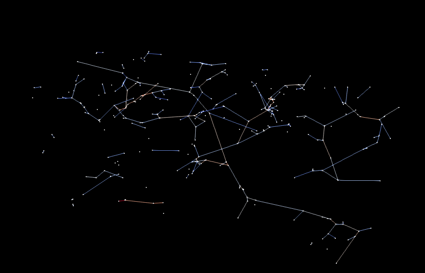

# RSOM vessel feature extraction
 

## Preface
The repository was build on top of [this](https://github.com/stefanhige/pytorch-rsom-seg) implementation.
It contains the python source code to create a [metric graph](https://www.jmlr.org/papers/volume15/lecci14a/lecci14a.pdf) and extract features based on the segmentation of vessels from raster-scan optoacoustic mesoscopy (RSOM) data ([Aguirre J. et al., _Precision assessment of label-free psoriasis biomarkers with ultra-broadband optoacoustic mesoscopy_, Nat Biomed Eng 1, 0068 (2017)](https://www.nature.com/articles/s41551-017-0068)).

## Setup

This repository was tested on Ubuntu 16.04.6 LTS and 
18.04.3 LTS.

It uses git large file storage.
In order to work it correctly you need to install `git lfs` following [this manual for git lfs](https://git-lfs.github.com/).
As an alternative, you can clone the repository as usual, and download the large files in `./data/input` and `./data/models` manually.

A GPU with 16GiB memory is highly recommended.

The main python dependencies are
* nibabel
* torch
* networkx

However, for a complete list, see and run

`$ pip install -r requirements.txt`

## Usage
In `./data/input` there are example matlab files, which serve as input.
Files must follow a naming scheme similar to `R_<datetime>_<letter-number identifier>_{LF,HF}.mat`. 
Surface files, if present, must be named `Surf_<datetime>.mat`.
Currently there is no support for other input file types, however, writing a 
wrapper for any needed file format can be done with little effort.

To execute the feature extraction and the corresponding epidermis and vessel segmentation, run

`$ CUDA_VISIBLE_DEVICES=X python pipeline.py`

If you want to change input and output files, or use cpu for
computation, edit `pipeline.py` accordingly.

If you have a smaller GPU, you can edit variable `divs=(1,1,2)`,
to `divs=(1,2,2)`, or even larger values. `divs` are the numbers, the input
tensor is split in each dimension, and closely related to the amount of memory required.

## Results

After successful execution, results are placed in `./data/output/`. Features are saved to `./data/output/features.csv`. 
Segmentation visualizations are saved to `./data/output/visualization/segmentation`. 
The metric graph can be visualized with [ParaView](https://www.paraview.org/) 
and the corresponding `*.vtk` files can be found in `./data/output/visualization/metric_graph`.
Furthermore, all intermediate results are placed in `./data/output/tmp`.
If one wishes to remove intermediate results, `pipeline.py` can be adjusted accordingly.

Let G be the metric graph and M be the vessel segmentation mask.

|Feature|Description|
|-------|-----------|
|epidermis_volume|Volume of the epidermis in pixel.|
|mg_length|Sum of the length of edges of the G in pixel.|
|#bifurcations|Number of nodes of G with a degree higher than 2.|
|#nodes|Number of nodes of G.|
|#edges|Number of edges of G.|
|#components|Number of connected components of G.|
|#nodes_per_component|Number of nodes per component of G.|
|length_per_component|Average length of the edges per connected component of G in pixel.|
|giant_component_length|Length of the edges of the biggest connected component of G in pixel.|
|average_path_length|Average shortest path length from every node to every other node of G in pixel.|
|density|[Density](https://networkx.org/documentation/stable/reference/generated/networkx.classes.function.density.html) of G|
|degree_assortativity_coefficient|Measures the similarity of connections in the graph with respect to the node degree ([source](https://networkx.org/documentation/networkx-1.10/reference/generated/networkx.algorithms.assortativity.degree_assortativity_coefficient.html#networkx.algorithms.assortativity.degree_assortativity_coefficient)).|
|num_cycles|Number of cycles of G.|
|bin1|Proportion of number of edges of G with a radius between 1 and 2 pixel.|
|bin2|Proportion of number of edges of G with a radius between 2 and 3 pixel.|
|bin3|Proportion of number of edges of G with a radius between 3 and 4 pixel.|
|bin4|Proportion of number of edges of G with a radius between 4 and 7 pixel.|
|avg_radius_giant|Average radius of edges of biggest component of G.|
|avg_radius|Average radius of edges of G.|
|len_minimum_spanning_tree|Length of the minimum spanning tree of G in pixel.|
|voxel_volume|Volume of M in pixel.|
|surface_volume_ratio|Surface are of M divided by the volume of M in pixel.|

## References

[[1]](https://arxiv.org/abs/1505.04597) Ronneberger, O., Fischer, P., Brox, T., _U-Net: Convolutional networks for biomedical image segmentation._

[[2]](https://arxiv.org/abs/1803.09340) Tetteh G. et al., _DeepVesselNet: Vessel Segmentation, Centerline Prediction, and Bifurcation Detection in 3-D Angiographic Volumes._

[[3]](https://www.nature.com/articles/s41551-017-0068) Aguirre J. et al. _Precision assessment of label-free psoriasis biomarkers with ultra-broadband optoacoustic mesoscopy_, Nat Biomed Eng 1, 0068 (2017)

[[4]](https://www.biorxiv.org/content/10.1101/613257v1) Mihail Ivilinov Todorov, Johannes C. Paetzold, _Automated analysis of whole brain vasculature using machine learning

[[5]](https://arxiv.org/abs/2007.05324) Stefan Gerl, Johannes C. Paetzold, _A distance-based loss for smooth and continuous skin layer segmentation in optoacoustic images 

[[6]](https://arxiv.org/abs/2003.07311) Suprosanna Shit, Johannes C. Paetzold, _clDice -- a Topology-Preserving Loss Function for Tubular Structure Segmentation

#### TODO
- [ ] add diabetes classifier
- [ ] rename features 
- [ ] feature selection
- [ ] add example input/output
- [ ] references
