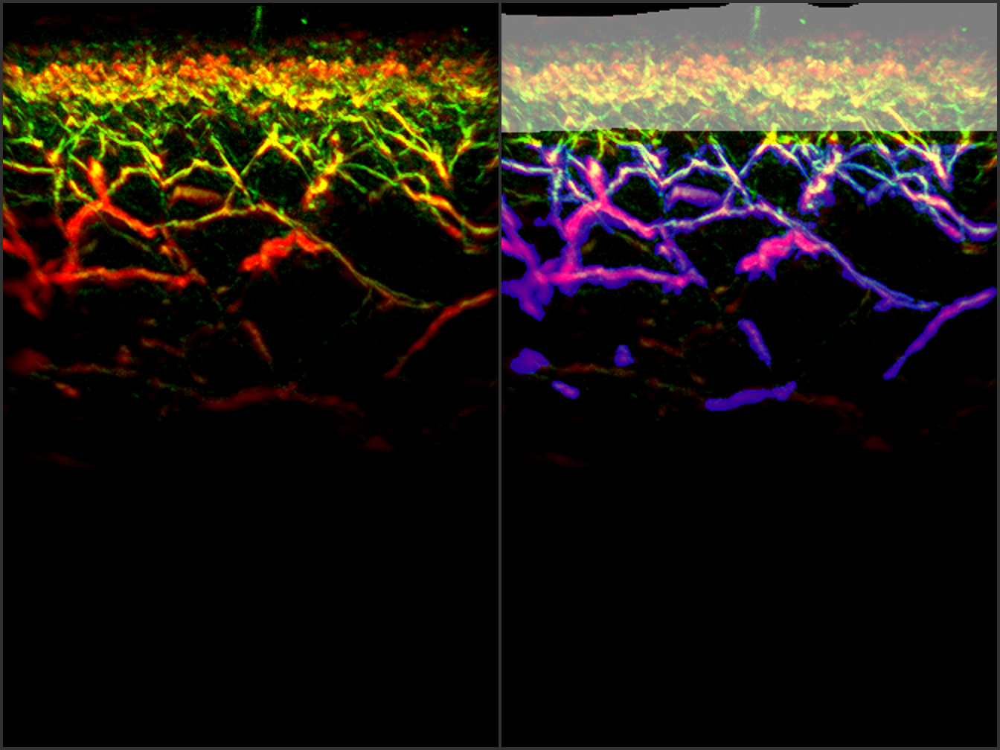
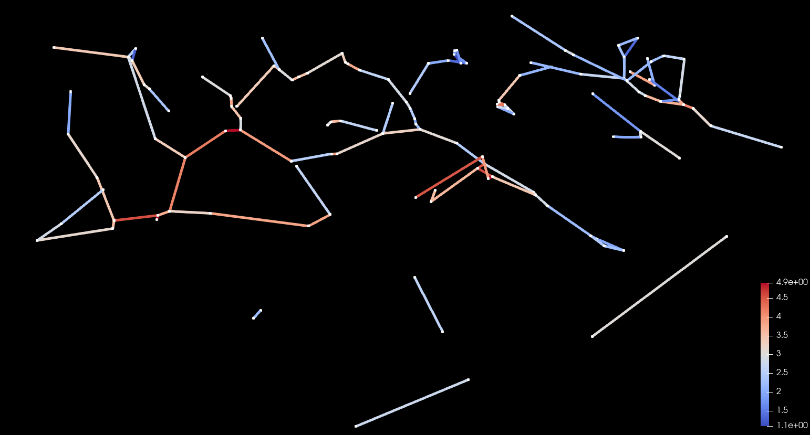

# RSOM feature extraction

## Preface

The repository was built upon Gerl et al. findings [[5]](#5) and bases on [this](https://github.com/stefanhige/pytorch-rsom-seg) implementation.
It contains the python source code to extract three-dimensional features from raster-scan optoacoustic mesoscopy (RSOM) data [[3]](#3), with the use of deep learning-based segmentation techniques and metric graph reconstruction [[7]](#7).

## Setup

This repository was tested on Ubuntu 16.04.6 LTS and 
18.04.3 LTS.

It uses git large file storage.
In order to work it correctly, you need to install `git lfs` following [this manual for git lfs](https://git-lfs.github.com/).
As an alternative, you can clone the repository as usual and download the large files in `./data/input` and `./data/models` manually.

A GPU with 16GiB memory is highly recommended.

The main python dependencies are
* nibabel
* torch
* networkx

However, for a complete list, see and run

`$ pip install -r requirements.txt`

## Usage

In `./data/input`, there are example matlab files, which serve as input.
Files must follow a naming scheme similar to `R_<datetime>_<letter-number identifier>_{LF,HF}.mat`. 
Surface files, if present, must be named `Surf_<datetime>.mat`.
Currently, there is no support for other input file types. However, writing a 
wrapper for any needed file format can be done with little effort.

To execute the feature extraction and the corresponding epidermis and vessel segmentation, run

`$ CUDA_VISIBLE_DEVICES=X python pipeline.py`

If you want to change input and output files, or use CPU for
computation, edit `pipeline.py` accordingly.

If you have a smaller GPU, you can edit variable `divs=(1,1,2)`,
to `divs=(1,2,2)`, or even larger values. `divs` are the numbers, the input
tensor is split in each dimension, and closely related to the amount of memory required. 

The feature extraction requires a set of parameters, which can be defined in `pipeline.py` and are subsequently summarized. Let `G` be the metric graph, `E` the epidermis segmentation mask, and `V` the vessel segmentation mask.

| Parameter             | Description                                                                                                                                                                                               |
|:---------------------------|:----------------------------------------------------------------------------------------------------------------------------------------------------------------------------------------------------------|
| laynet_depth               | The depth of the U-Net being used for the epidermis segmentation.                                                                                                                                         |
| ves_probability            | The probability threshold for the vessel segmentation.                                                                                                                                                    |
| min_size                   | Objects with a volume smaller than `min_size` pixel are removed from the `V` to maintain large independent vessels solely.                                                                                |
| epidermis_offset           | Our feature extraction can be limited to an ROI in order to exclude systematic appearing noise. The 'epidermis_offset' defines the number of z-slices that should be excluded from the upper dermal part. |
| roi_z                      | The total number of z-slices of the ROI, beginning from `epidermis_offset`.                                                                                                                               |
| min_component_length       | Connected components smaller than `min_component_length` pixel are removed from G to discard small unpaired artifacts.                                                                                    |
| min_end_branch_length      | We remove ending branches of `G` smaller than `min_end_branch_length` pixel to capture the actual underlying topology better.                                                                             |
| min_total_length           | Sampels with a total metric graph length smaller than `min_total_length` pixel are automatically excluded from the feature extraction.                                                                    |
| show_roi                   | Whether to mark the ROI in pink color.                                                                                                                                                                    |
| show_preprocessing_results | Whether to visualize preprocessed `V` or untouched `V`.                                                                                                                                                       |

## Results

After successful execution, results are placed in `./data/output/`. Features are saved to `./data/output/features.csv`. 
Segmentation visualizations are saved to `./data/output/visualization/segmentation`. 
The reconstructed metric graphs can be visualized with [ParaView](https://www.paraview.org/) 
and the corresponding `*.vtk` files can be found in `./data/output/visualization/metric_graph`.
Furthermore, all intermediate results are placed in `./data/output/tmp`.
If one wishes to remove intermediate results, `pipeline.py` can be adjusted accordingly. For reproducibility we log the parameters and removed sample names to `./data/output/<<TIMESTAMP>>.log`.

### Visualizations

| Epidermis and vesssel segmentation | Metric graph (ParaView) |
|:----------------------------------:|:--------------------:|
|               |  |

### Main features

|Feature|Description|
|-------|-----------|
|total_vessel_length|Sum of the length of edges of `G` in pixel.|
|small_vessel_length|Sum of the length of edges of `G` in pixel having an average radius smaller than 2.5 pixels.|
|large_vessel_length|Sum of the length of edges of `G` in pixel having an average radius greater than or equal to 2.5 pixels.|
|#vessel_bifurcations|Number of nodes of `G` with a degree higher than 2.|
|total_blood_volume|Volume of `V` in micrometers³.|
|epidermis_width|Average width in z-direction of `E` in micrometers.|

### Experimental features

| Feature                          | Description                                                                                                                                                                                                                                                                                                      |
|:---------------------------------|:-----------------------------------------------------------------------------------------------------------------------------------------------------------------------------------------------------------------------------------------------------------------------------------------------------------------|
| surface_volume_ratio             | Surface area of `V` divided by the volume of `V` in pixel.                                                                                                                                                                                                                                                       |
| epidermal_signal_density         | The signal density of `E`, which was computed by multiplying the input volume with `E` and normalizing its sum by the total epidermis volume.                                                                                                                                                                    |
| #components                      | Number of connected components of `G`.                                                                                                                                                                                                                                                                           |
| #nodes_per_component             | Number of nodes per component of `G`.                                                                                                                                                                                                                                                                            |
| length_per_component             | Average length of the edges per connected component of `G` in pixel.                                                                                                                                                                                                                                             |
| density                          | [Density](https://networkx.org/documentation/stable/reference/generated/networkx.classes.function.density.html) of `G`.                                                                                                                                                                                          |
| degree_assortativity_coefficient | Measures the similarity of connections in the graph with respect to the node degree ([source](https://networkx.org/documentation/networkx-1.10/reference/generated/networkx.algorithms.assortativity.degree_assortativity_coefficient.html#networkx.algorithms.assortativity.degree_assortativity_coefficient)). |
| num_cycles                       | Number of cycles of `G`.                                                                                                                                                                                                                                                                                         |
| avg_radius                       | Average radius of `G`'s edges.                                                                                                                                                                                                                                                                                   |
| avg_path_length | Average shortest path length from eacz node to every other node of `G` in pixel.|                                 |                                                                                                                                                                                                                                                                                                                  |

## References
<a id="1">[1]</a>
[Ronneberger, O., Fischer, P., Brox, T., _U-Net: Convolutional networks for biomedical image segmentation._](https://arxiv.org/abs/1505.04597) 

<a id="2">[2]</a>
[Tetteh G. et al., _DeepVesselNet: Vessel Segmentation, Centerline Prediction, and Bifurcation Detection in 3-D Angiographic Volumes._](https://arxiv.org/abs/1803.09340)

<a id="3">[3]</a>
[Aguirre J. et al. _Precision assessment of label-free psoriasis biomarkers with ultra-broadband optoacoustic mesoscopy, Nat Biomed Eng 1, 0068 (2017)_](https://www.nature.com/articles/s41551-017-0068) 

<a id="4">[4]</a>
[Mihail Ivilinov Todorov, Johannes C. Paetzold, _Automated analysis of whole brain vasculature using machine learning_](https://www.biorxiv.org/content/10.1101/613257v1)

<a id="5">[5]</a>
[Stefan Gerl, Johannes C. Paetzold, _A distance-based loss for smooth and continuous skin layer segmentation in optoacoustic images_](https://arxiv.org/abs/2007.05324)

<a id="6">[6]</a>
[Suprosanna Shit, Johannes C. Paetzold, _clDice -- a Topology-Preserving Loss Function for Tubular Structure Segmentation_](https://arxiv.org/abs/2003.07311)

<a id="7">[7]</a>
[Mridul Aanjaneya et al. _Metric Graph Reconstruction From Noisy Data_](http://cgl.uni-jena.de/pub/Publications/WebHome/CGL-TR-34.pdf) 
